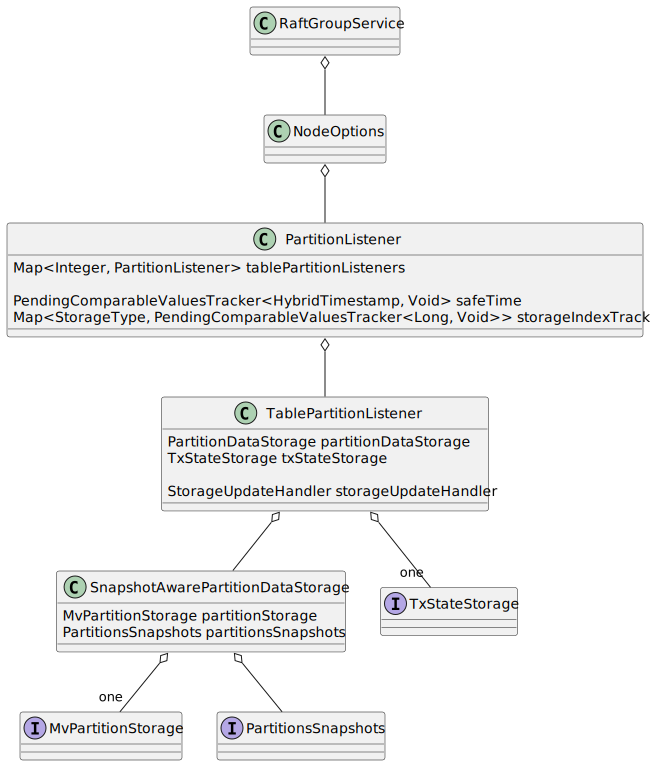

# Motivation
At the moment Ignite-3 has the partition data layout built around the table partitions. It means, that every table has it's own node assignments for every partition. This architecture has some benefits, but at the same time it doesn't take in mind the data collocation opportunity. So, to enable the collocation for two tables we need to discover the separate mechanisms on top of the zones and tables. After some discussions inside the architect team we decide to go the other way and rebuild the data layout around the zone based partitions. In that case all tables, which share the same zone will be collocated by design.

# Design overview
For the present table partition is the heart of our replication mechanism. Each table partition forms the RAFT group with the the number of replicas (peers) according to its configuration. Also, the whole distributed rebalance mechanism based on the rebalance of table partitions as a result.
But for the collocation purpose we must change this approach to the following one:
- The configuration numbers for partitions and replicas must be migrated from the table configuration to the zone one. (already done in the main branch)
- Replication layer (RAFT for now) must be build around the zone partitions instead of the table partitions.
- Component recovery and further communication must be changed in appropriate way to support the 
<TODO picture here with the old and new data layouts>

# Redesign replication layer
At the moment each table partition has it's own `RaftGroupService` with appropriate state machine, which aware about the table partition storages.

Instead of that we need to have a point to extend the partition listener with the some table partition listeners, which ingest the input data to appropriate table storages and snapshot logic (TODO: check if current snapshot logic will be working as is in this design)



# Component recovery and communication
At present the replication peer lifecycle is highly coupled with the table partition lifecycle. So, on the table create/drop on the current node we can just start/stop the replication servers simultaneously. But now we are coupling the partition lifecycle with the zones, but the replication state machines are still bound to the table partitions. So, we need to update the component structure and lifecycle, because zones and tables are controlled by the different ignite components (`DistributionZoneManager` and `TableManager`).

So, on the previous step we prepared the extension point to update the replication state machine with the delegated "small" state machines for each table partition inside the zone partition. But let's focus on the start process of the node and recovery process

1. `DistributionZoneManager` started (DZM)
2. DZM got the list of the zones from `CatalogManager`
3. DZM recover the itself zone states and add the needed zone server endpoints to start queue (DISCUSSION POINT 1)
4. DZM start finished
5. `TableManager` started
6. `TableManager` got the list of tables from `CatalogManager`
7. `TableManager` for each local zone partition:
    - create the needed storages
    - create the `TablePartitionListener` and add it to the appropriate zone partition state machine
    - get the partition client for the table partitions `Replica` and start needed local `Replica` instances (DISCUSSION POINT 2)
8. `TableManager` start finished

## Discussion point 1
The main issue here, that as soon as we start any replication server endpoint (RAFT node actually for now), the replication process to this node will start immediately. But at this point we don't have needed table state machines yet. 

In general, we can hang the replication process here, while the needed delegate for the replication state machine is not ready yet. But this approach can produce unneeded perturbations in replication protocol, this peer can be identified as a sick peer (we can use any replication protocols here in future) and etc. 

So, if we know that we are not ready yet here, let's introduce the logic, which can postpone the replication server start, while the recovery process is not done and we are awaiting for the start of table partition state machines.

Meet the new component `ReplicationServerManager` and look at the appropriate section with the details.

## Discussion point 2
Here we need to prepare the replication clients (`org.apache.ignite.internal.raft.service.RaftGroupService` at the moment, do not confuse it with the server class `org.apache.ignite.raft.jraft.RaftGroupService` from the previous chapters). It will be wrapped in the `TopologyAwareRaftGroupService` actually, but we can skip it now for the clarity.

In general, client has the main needed information - it's a replication group peers structure. This information available from the assignments of the zone partition, so, available inside the DZM logic. So, it looks like we can get the zone assignments from DZM and start the needed client by `Loza` as usual.

# ReplicationServerManager component
ReplicationServerManager component is the component, which:
- before the start acts like the temporary queue for the replication servers, which must be started on start
- after the start it must immediately apply the replication servers updates instead
The API can looks like

```java
interface ReplicationServerManager implements IgniteComponent {
    CompletableFuture<Void> addReplicationServer(
            PartitionId id,
            PeersAndLearners configuration,
            RaftGroupEventsListener evLsnr,
            RaftGroupOptions groupOptions
    );
    
    CompletableFuture<Void> addTablePartitionListener(
            PartitionId id,
            int tableId,
            TablePartitionListener listener
    );
    
    void start();
    
    void stop();
}
```


# In-memory case
TODO
In-memory case is a real issue, because now we just remove the peer from the raft topology and add it again to ingest the data to local partition. But after the migration to zone based partitions, we can't support this approach anymore if we want to allow the usual and in-memory tables in one zone at the same time.

